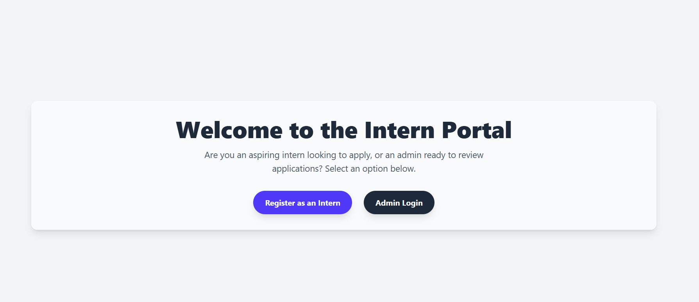
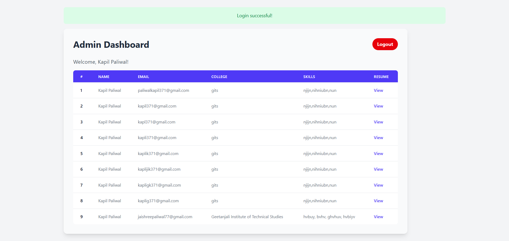

# basti-ki-pathshala


# 📘 Internship Management System

This project is a **web-based Internship Management System** built using:

- **Node.js** backend (with Express.js, Mongoose, JWT for authentication)
- **React.js** frontend (with Tailwind CSS for styling)

The application offers two main interfaces:

1. A **public-facing form** for interns/volunteers to submit applications
2. A **protected admin dashboard** to manage and review submitted applications

---

## 🚀 Key Features

### 📝 Intern/Volunteer Registration
- A user-friendly form for applicants
- Captures:
  - Personal details
  - Academic background
  - Skills
  - Resume URL

### 🔐 Admin Authentication
- Secure login for administrators

### 📊 Admin Dashboard
- Protected admin panel
- Displays a list of all submitted applications

### 🔁 Backend APIs
- REST APIs for:
  - Admin login/signup
  - Intern registration
  - Fetching all applicants (admin-only access)

---

## ⚙️ How to Run the Project

### ✅ Prerequisites
- **Node.js** and **npm** installed

---

### 📦 1. Backend Setup

1. **Clone or copy the backend files:**

   Make sure you have:
   - `index.js`
   - `Routes.js`
   - `DB_Connect.js`
   - `Admin.js`
   - `Interns.js`
   - `AuthController.js`
   - `middleware.js`
   - `.env`
   - `package.json`
   - `package-lock.json`

2. **Install dependencies:**

   ```bash
   npm install


3. **Configure the `.env` file:**

   Create a `.env` file in the backend root:

   ```
   KEY=help_everyone
   PORT=3000
   DATABASE=mongodb://localhost:27017/intern
   ```

4. **Start the server:**

   ```bash
   node index.js
   ```

   You should see the backend running on `http://localhost:3000`.

---

### 💻 2. Frontend Setup

1. **Use the provided React code:**

   * Replace the contents of `src/App.jsx` with the provided `App.jsx` file.

2. **Install frontend dependencies:**

   ```bash
   npm install
   ```

   Also install Tailwind CSS following the official setup instructions if not already set up.

3. **Start the frontend:**

   ```bash
   npm start
   ```

   The frontend will typically run at `http://localhost:3000`.

---

## 📸 Screenshots

### 🏠 Home Page

<!-- Add Home Page Screenshot Here -->



---

### 📝 Intern Registration Form

<!-- Add Registration Form Screenshot Here -->


---

### 🛠️ Admin Dashboard

<!-- Add Admin Dashboard Screenshot Here -->



---


